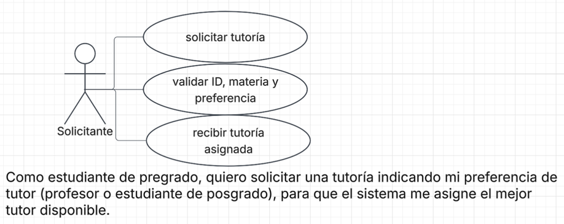
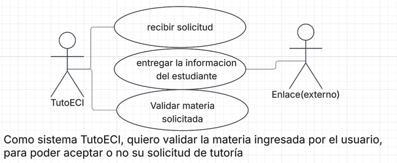

# DOSW_ParcialT1_MiguelMurillo

## 1. Diagrama de Contexto.

![Diagrama de Contexto - TutoECI] ()

## 2. Requerimientos del Sistema

### 2.1 Lista General de Requerimientos

El sistema TutoECI tiene los siguientes requerimientos (descripción a alto nivel):

#### 2.1.1 Requerimientos Funcionales

El sistema TutoECI debe tener la capacidad de:

1. Permitir a un solicitante (estudiante de pregrado) solicitar una tutoría, indicando su preferencia de tutor (estudiante de posgrado o profesor)
2. Validar las materias del solicitante mediante enlace académico
3. Enviar un mensaje de confirmación de la tutoría al estudiante, indicando fecha y hora de esta misma.

#### 2.1.2 Requerimientos no Funcionales

El Sistema TutoECI debe tener:

1. La interfaz debe permitir al estudiante solicitar una tutoría en menos de 5 pasos.
2. La interfaz debe incorporar los colores representativos del programa de Ingenieria de Sistemas de la Escuela
3. El sistema debe emplear una tipografía legible y que facilite la lectura de hlos horarios y perfiles de tutores

### 2.2 Diagramas de caso de uso

#### 2.2.1 Requerimiento Funcional 1

| Campo | Descripción |
|------|-------------|
| **ID** | RF-01 |
| **Nombre del requerimiento** | Solicitud de tutoría por parte de estudiante |
| **Descripción** | *El sistema debe permitir a un estudiante solicitar una tutoría, dejando elegir su preferencia de tutor* |
| **Precondiciones** | *El estudiante debe estar inscrito en la materia a la cual está solicitando una tutortía * |
| **Actor** | *Solicitante (estudiante pregrado) * |
| **Flujo principal** | 1. El estudiante selecciona la opción "Solicitud de tutorías".  2. El sistema recibe el ID del estudiante, la sigla de la materia y la preferencia.  3. El sistema crea la solicitud de tutoria |
| **Diagrama de caso de uso** | **|
| **Poscondiciones** | *La solicitud queda guardada y en espera de validación * |

#### 2.2.2 Requerimiento Funcional 2

| Campo | Descripción |
|------|-------------|
| **ID** | RF-02 |
| **Nombre del requerimiento** | Validación de materia solicitada |
| **Descripción** | *El sistema debe validar mediante Enlace si el solicitante está inscrito en la metaria la cual está solicitando una tutoría* |
| **Precondiciones** | *El estudiante debe haber creado una solicitud de tutoría en el Sistema TutoECI * |
| **Actor** | *TutoECI * |
| **Flujo principal** | 1. El sistema recibe el ID del solicitante  2. Enlace recibe el ID del estudiante   3. Enlace entrega la información del estudiante (ID, nombre, programa y materias inscritas) en en un documento en formato JSON.  4. TutoECI valida que la matería solicitada haya sido inscrita por el estudiante |
| **Diagrama de caso de uso** | *()*|
| **Poscondiciones** | *La solicitud de tutoria es aprobada y reservada, o denegada.* |

#### 2.2.3 Requerimiento Funcional 3

| Campo | Descripción |
|------|-------------|
| **ID** | RF-03 |
| **Nombre del requerimiento** | Mensaje de confirmación |
| **Descripción** | *El sistema debe enviar al estudiante un mensaje de confirmación por el correo una vez la reserva sea asignada y confirmada.* |
| **Precondiciones** | *El estudiante debe haber creado una solicitud de tutoría y TutoECI debe validar la materia a la cual se solicitó la tutoria* |
| **Actor** | *NotifyMe * |
| **Flujo principal** | 1. La solicitud es creada por el estudiante y validada mediante enlace  2. El sistema NotifyMe recibe la confirmación  3. NotifyMe envía el mensaje de confirmación al estudiante |
| **Poscondiciones** | *El estudiante recibe en su correo un mensaje de confirmacion, con fecha y hora de la tutoría adignada.* |

